# 浅析GPU通信技术  
* 单机多卡——>GPUDirect & NVLink   
* 多机多卡——>GPUDirect RDMA   

## 一、GPUDirect
### 1.1 背景
GPU在高性能计算和深度学习加速中扮演着非常重要的角色， GPU的强大的并行计算能力，大大提升了运算性能。随着运算数据量的不断攀升，**GPU间需要大量的交换数据**，**GPU通信性能**成为了非常重要的指标。NVIDIA推出的**GPUDirect**就是一组提升GPU通信性能的技术。但GPUDirect受限于PCI Expresss总线协议以及拓扑结构的一些限制，无法做到更高的带宽，为了解决这个问题，NVIDIA提出了NVLink总线协议。   

### 1.2 GPUDirect介绍
#### 1.2.1 简介
GPUDirect技术有如下几个关键特性：   
* 加速与网络和存储设备的通信：
* GPU之间的Peer-to-Peer Transers
* GPU之间的Peer-to-Peer memory access
* RDMA支持
* 针对Video的优化  
  
下面对最主要的几个技术做分别介绍。   
#### 1.2.2 Shared Memory
**2010年6月**最先引入的是GPUDirect Shared Memory 技术，支持GPU与第三方PCI Express设备通过共享的pin住的host memory实现共享内存访问从而加速通信。   
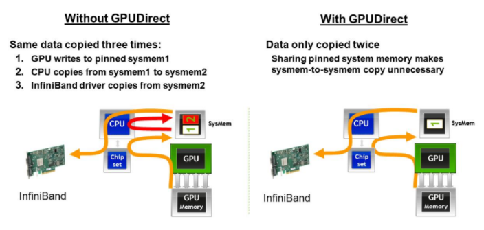  
#### 1.2.3 P2P 
**2011年**，GPUDirect增加了相同PCI Express root complex 下的GPU之间的Peer to Peer(P2P) Direct Access和Direct Transers的支持。   
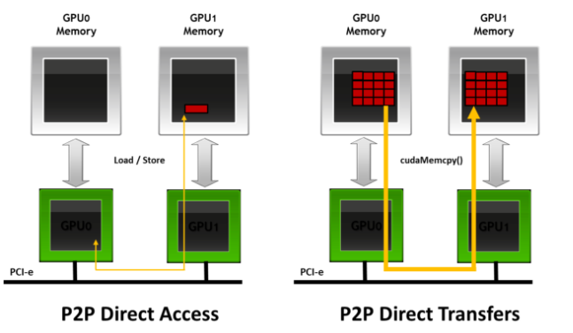   
#### 1.2.4 RDMA
**2013年**，GPUDirect增加了RDMA支持，使得第三方PCI Express设备可以bypass CPU host memory直接访问GPU。
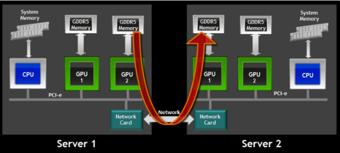   
### 1.3 GPUDirect P2P
#### 1.3.1 P2P简介
GPUDirect Peer-to-Peer(P2P) 技术主要**用于单机GPU间的高速通信，它使得GPU可以通过PCI Express直接访问目标GPU的显存，避免了通过拷贝到CPU host memory作为中转，大大降低了数据交换的延迟**。  
以深度学习应用为例，主流的开源深度学习框架如TensorFlow、MXNet都提供了对GPUDirect P2P的支持，NVIDIA开发的NCCL(NVIDIA Collective Communications Library)也提供了针对GPUDirect P2P的特别优化。   
**通过使用GPUDirect P2P技术可以大大提升深度学习应用单机多卡的扩展性，使得深度学习框架可以获得接近线性的训练性能加速比。**   
#### 1.3.2 P2P虚拟化  

随着云计算的普及，越来越多技术迁移到云上，在云上使用GPUDirect技术，就要解决GPUDirect虚拟化的问题。

这里我们着重讨论下GPUDirect Peer-to-Peer虚拟化的问题

使用PCI Pass-through虚拟化技术可以将GPU设备的控制权完全授权给VM，使得虚拟机里的GPU driver可以直接控制GPU而不需要Hypervisor参与，性能可以接近物理机。   
   
但是同一个虚拟机内的应用却无法使用P2P技术与其它GPU实现通信。下面分析一下无法使用P2P的原因。
  
首先我们需要知道一个技术限制，就是不在同一个Intel IOH(IO Hub)芯片组下面PCI-e P2P通信是不支持的，因为Intel CPU之间是QPI协议通信，PCI-e P2P通信是无法跨QPI协议的。所以GPU driver必须要知道GPU的PCI拓信息，同一个IOH芯片组下面的GPU才能使能GPUDiret P2P。

但是在虚拟化环境下，Hypervisor虚拟的PCI Express拓扑结构是扁平的，GPU driver无法判断真实的硬件拓扑所以无法开启GPUDirect P2P。

为了让GPU driver获取到真实的GPU拓扑结构，需要在Hypervisor模拟的GPU PCI配置空间里增加一个PCI Capability，用于标记GPU的P2P亲和性。这样GPU driver就可以根据这个信息来使能P2P。

另外值得一提的是，在PCI Pass-through时，所有的PCI Express通信都会被路由到IOMMU，P2P通信同样也需要路由到IOMMU，所以Pass-through下的P2P路径还是会比物理机P2P长一点，延迟大一点。   
  
#### 1.3.3 实测

下面是我们在阿里云GN5实例(8卡Tesla P100)上对GPUDirect P2P延迟做的实测数据。

GPU P2P矩阵如下：  
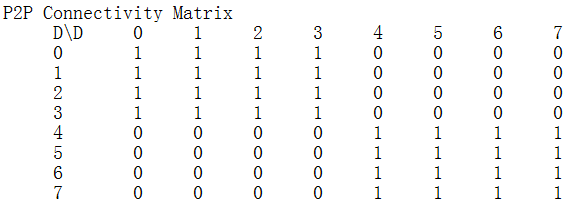  
通信延迟对比如下：   
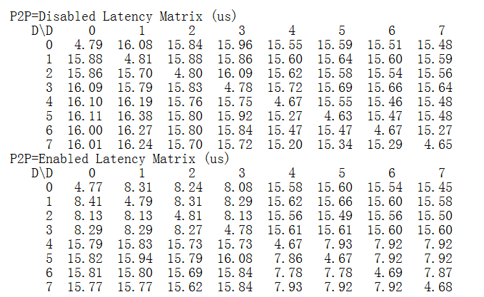   
我们看到：使能GPUDirect P2P后GPU间通信延迟相比CPU拷贝降低近一半。  
下图是在GN5实例上使用MXNet对经典卷积神经网络的图像分类任务的训练性能的加速比：   
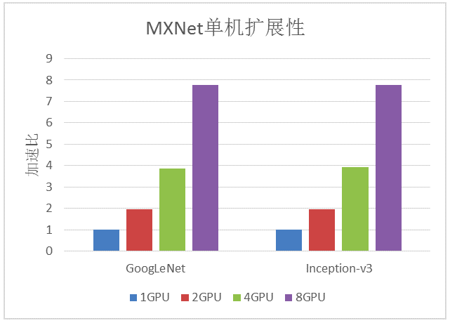   
MXNet在支持P2P的GN5实例上有非常好的单机扩展性，训练性能接近线性加速。   
## 二、NVLink  
### 2.1 背景  
上面我们提到通过GPUDirect P2P技术可以大大提升GPU服务器**单机的GPU通信性能**，但是受限于PCI Expresss总线协议以及拓扑结构的一些限制，无法做到更高的带宽，为了解决这个问题，NVIDIA提出了NVLink总线协议。  
本篇文章我们就来谈谈NVIDIA提出的NVLink总线协议，看看它到底是何方神圣。    
### 2.2 NVlink介绍

#### 2.2.1 发布

NVLink技术是在2014年3月的NVIDIA GTC 2014上发布的。对普通消费者来说，这一届的GTC似乎没有太多的亮点，也没有什么革命性的产品发布。这次GTC上，黄仁勋展示了新一代单卡双芯卡皇GeForce Titan Z，下一代GPU架构Pascal也只是初露峥嵘。在黄仁勋演讲中只用大约五六页PPT介绍的NVLink也很容易被普通消费者忽视，但是有心的专业人士确从此举看到了NVIDIA背后巨大的野心。

首先我们简单看下NVIDIA对NVLink的介绍：NVLink能在多GPU之间和GPU与CPU之间实现非凡的连接带宽。带宽有多大？2016发布的P100是搭载NVLink的第一款产品，单个GPU具有160GB/s的带宽，相当于PCIe Gen3 * 16带宽的5倍。去年GTC 2017上发布的V100搭载的NVLink 2.0更是将GPU带宽提升到了300G/s，差不多是PCIe的10倍了。

好了，这下明白了为什么NVIDIA的NVLink会如此的引人注意了。但是NVLink背后的布局远不只是如此。   
  
#### 2.2.2 解读

我们来看看NVLink出现之前的现状：

1)PCIe：

PCIe Gen3每个通道（每个Lane）的双向带宽是2B/s，GPU一般是16个Lane的PCIe连接，所以PCIe连接的GPU通信双向带宽可以达到32GB/s，要知道PCIe总线堪称PC系统中第二快的设备间总线（排名第一的是内存总线）。但是在NVLink 300GB/s的带宽面前，只有被碾压的份儿。

2)显存带宽：

上一代卡皇Geforce Titan XP的GDDR5X显存带宽已经达到547.7 GB/s，搭载HBM2显存的V100的带宽甚至达到了900GB/s。显卡核心和显存之间的数据交换通道已经达到如此高的带宽，但是GPU之间以及GPU和CPU之间的数据交换确受到PCIe总线的影响，成为了瓶颈。这当然不是NVIDIA希望看到的，而NVLink的出现，则是NVIDIA想打破这个瓶颈的宣言。

 3）CPU连接：

实际上，NVLink不但可以实现GPU之间以及GPU和CPU之间的互联，还可以实现CPU之间的互联。从这一点来看，NVLink的野心着实不小。

我们知道，Intel的CPU间互联总线是QPI，**20位宽的QPI连接带宽也只有25.6GB/s**，在NVLink面前同样差距巨大。可想而知，如果全部采用NVLink总线互联，会对系统数据交换通道的带宽有多大提升。

当然，NVIDIA自己并没有CPU，X86仍然是当今CPU的主流架构，被Intel把持方向和趋势，NVLink绝没有可能进入X86 CPU连接总线的阵营。于是便有了NVIDIA和IBM组成的OpenPower联盟。

NVIDIA是受制于没有CPU，而IBM则恰好相反，IBM有自己的CPU，Power 处理器的性能惊艳，但IBM缺少相应的并行计算芯片，因此仅仅依靠自己的CPU，很难在目前的异构计算中发挥出优秀的性能、规模和性能功耗比优势。从这一点来看，IBM和NVIDIA互补性就非常强了，这也是IBM为什么要和NVIDIA组建OpenPower超级计算联盟的原因了。

考虑到目前POWER生态的逐渐萎缩，要想在人工智能浪潮下趁机抢占X86的市场并不是件容易的事情，但至少给了NVIDIA全面抗衡Intel的平台。

所以有点扯远了，NVLink目前更主要的还是大大提升了GPU间通信的带宽。
#### 2.2.3 结构和拓扑

##### 1） NVLink信号与协议

NVLink控制器由3层组成，即物理层（PHY）、数据链路层（DL）以及交易层（TL）。下图展示了P100 NVLink 1.0的各层和链路：  
P100搭载的NVLink 1.0，每个P100有4个NVLink通道，每个拥有40GB/s的双向带宽，每个P100可以最大达到160GB/s带宽。

V100搭载的NVLink 2.0，每个V100增加了50%的NVLink通道达到6个，信号速度提升28%使得每个通道达到50G的双向带宽，因而每个V100可以最大达到300GB/s的带宽。  
   
##### 2） 拓扑

下图是HGX-1/DGX-1使用的8个V100的混合立方网格拓扑结构，我们看到虽然V100有6个NVlink通道，但是实际上因为无法做到全连接，2个GPU间最多只能有2个NVLink通道100G/s的双向带宽。而GPU与CPU间通信仍然使用PCIe总线。CPU间通信使用QPI总线。这个拓扑虽然有一定局限性，但依然大幅提升了同一CPU Node和跨CPU Node的GPU间通信带宽。   
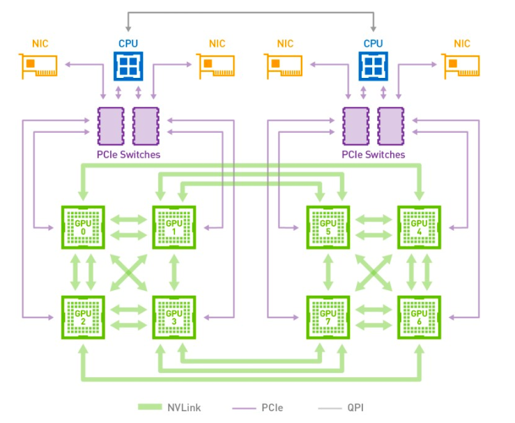   
##### 3) NVSwitch

为了解决混合立方网格拓扑结构的问题，NVIDIA在今年GTC 2018上发布了NVSwitch。

类似于PCIe使用PCIe Switch用于拓扑的扩展，NVIDIA使用NVSwitch实现了NVLink的全连接。NVSwitch作为首款节点交换架构，可支持单个服务器节点中 16 个全互联的 GPU，并可使全部 8 个 GPU 对分别以 300 GB/s 的惊人速度进行同时通信。这 16 个全互联的 GPU （32G显存V100）还可作为单个大型加速器，拥有 0.5 TB 统一显存空间和 2 PetaFLOPS 计算性能。

关于NVSwitch的相关技术细节可以参考NVIDIA官方技术文档。应该说这一技术的引入，使得GPU间通信的带宽又大大上了一个台阶。  
  
### 2.3 性能

NVIDIA NVLink 将采用相同配置的服务器性能提高 31%。
  

使用NVSwitch的DGX-2则能够达到2倍以上的深度学习和高性能计算的加速。  
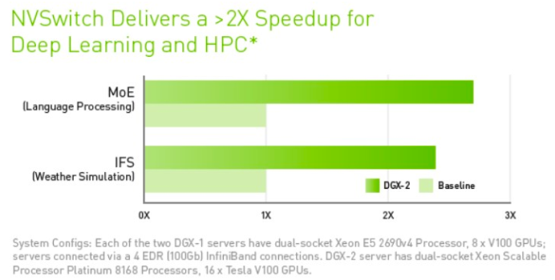   
## 三、GPUDirect RDMA  
### 3.1 背景  
前两篇文章（P我们介绍的GPUDirect P2P和NVLink技术可以大大提升GPU服务器单机的GPU通信性能，当前深度学习模型越来越复杂，计算数据量暴增，对于大规模深度学习训练任务，单机已经无法满足计算要求，多机多卡的分布式训练成为了必要的需求，这个时候多机间的通信成为了分布式训练性能的重要指标。

本篇文章我们就来谈谈GPUDirect RDMA技术，这是用于加速多机间GPU通信的技术。   
### 3.2 RDMA介绍
我们先来看看RDMA技术是什么？RDMA即Remote DMA，是Remote Direct Memory Access的英文缩写。  

#### 3.2.1 DMA原理

在介绍RDMA之前，我们先来复习下DMA技术。

我们知道DMA（直接内存访问）技术是Offload CPU负载的一项重要技术。DMA的引入，使得原来设备内存与系统内存的数据交换必须要CPU参与，变为交给DMA控制来进行数据传输。

直接内存访问(DMA)方式，是一种完全由硬件执行I/O交换的工作方式。在这种方式中， DMA控制器从CPU完全接管对总线的控制，数据交换不经过CPU，而直接在内存和IO设备之间进行。DMA工作时，由DMA 控制器向内存发出地址和控制信号，进行地址修改，对传送字的个数计数，并且以中断方式向CPU 报告传送操作的结束。

使用DMA方式的目的是减少大批量数据传输时CPU 的开销。采用专用DMA控制器(DMAC) 生成访存地址并控制访存过程。优点有操作均由硬件电路实现，传输速度快；CPU 基本不干预，仅在初始化和结束时参与，CPU与外设并行工作，效率高。   
#### 3.2.2 RMDA原理

RDMA则是在计算机之间网络数据传输时Offload CPU负载的高吞吐、低延时通信技术。   
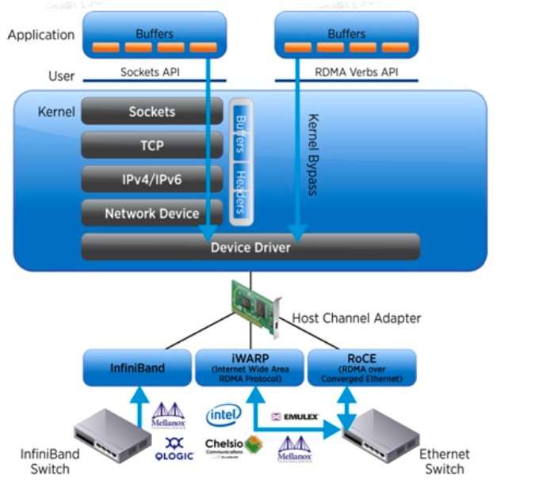   
如上图所示，传统的TCP/IP协议，应用程序需要要经过多层复杂的协议栈解析，才能获取到网卡中的数据包，而使用RDMA协议，应用程序可以直接旁路内核获取到网卡中的数据包。

RDMA可以简单理解为利用相关的硬件和网络技术，服务器1的网卡可以直接读写服务器2的内存，最终达到高带宽、低延迟和低资源利用率的效果。如下图所示，应用程序不需要参与数据传输过程，只需要指定内存读写地址，开启传输并等待传输完成即可。   
   
在实现上，RDMA实际上是一种智能网卡与软件架构充分优化的远端内存直接高速访问技术，通过在网卡上将RDMA协议固化于硬件，以及支持零复制网络技术和内核内存旁路技术这两种途径来达到其高性能的远程直接数据存取的目标。

（1）零复制：零复制网络技术使网卡可以直接与应用内存相互传输数据，从而消除了在应用内存与内核之间复制数据的需要。因此，传输延迟会显著减小。

（2）内核旁路：内核协议栈旁路技术使应用程序无需执行内核内存调用就可向网卡发送命令。在不需要任何内核内存参与的条件下，RDMA请求从用户空间发送到本地网卡并通过网络发送给远程网卡，这就减少了在处理网络传输流时内核内存空间与用户空间之间环境切换的次数。

在具体的远程内存读写中，RDMA操作用于读写操作的远程虚拟内存地址包含在RDMA消息中传送，远程应用程序要做的只是在其本地网卡中注册相应的内存缓冲区。远程节点的CPU除在连接建立、注册调用等之外，在整个RDMA数据传输过程中并不提供服务，因此没有带来任何负载。
  
#### 3.2.3 RDMA实现

如下图RMDA软件栈所示，目前RDMA的实现方式主要分为InfiniBand和Ethernet两种传输网络。而在以太网上，又可以根据与以太网融合的协议栈的差异分为iWARP和RoCE（包括RoCEv1和RoCEv2）。   
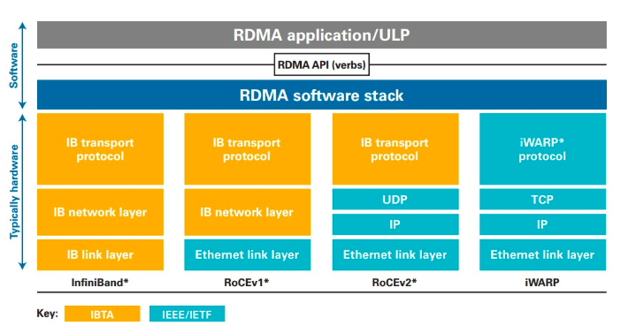   
其中，InfiniBand是最早实现RDMA的网络协议，被广泛应用到高性能计算中。但是InfiniBand和传统TCP/IP网络的差别非常大，需要专用的硬件设备，承担昂贵的价格。相比之下RoCE和iWARP的硬件成本则要低的多。   
   
### 3.3 GPUDirect RDMA介绍
#### 3.3.1 原理

有了前文RDMA的介绍，从下图我们可以很容易明白，所谓GPUDirect RDMA，就是计算机1的GPU可以直接访问计算机2的GPU内存。而在没有这项技术之前，GPU需要先将数据从GPU内存搬移到系统内存，然后再利用RDMA传输到计算机2，计算机2的GPU还要做一次数据从系统内存到GPU内存的搬移动作。GPUDirect RDMA技术使得进一步减少了GPU通信的数据复制次数，通信延迟进一步降低。   
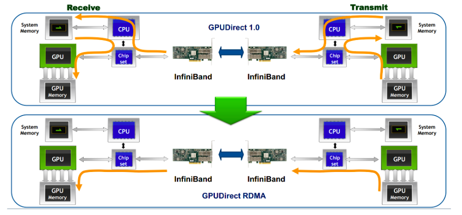   
#### 3.3.2 使用
需要注意的是，要想使用GPUDirect RDMA，需要保证GPU卡和RDMA网卡在同一个ROOT COMPLEX下，如下图所示：   
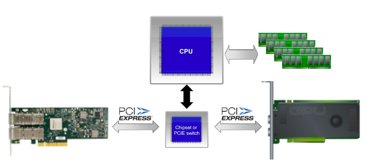  
#### 3.3.3 性能

Mellanox网卡已经提供了GPUDirect RDMA的支持（既支持InfiniBand传输，也支持RoCE传输）。

下图分别是使用OSU micro-benchmarks在Mellanox的InfiniBand网卡上测试的延时和带宽数据，可以看到使用GPUDirect RDMA技术后延时大大降低，带宽则大幅提升：   
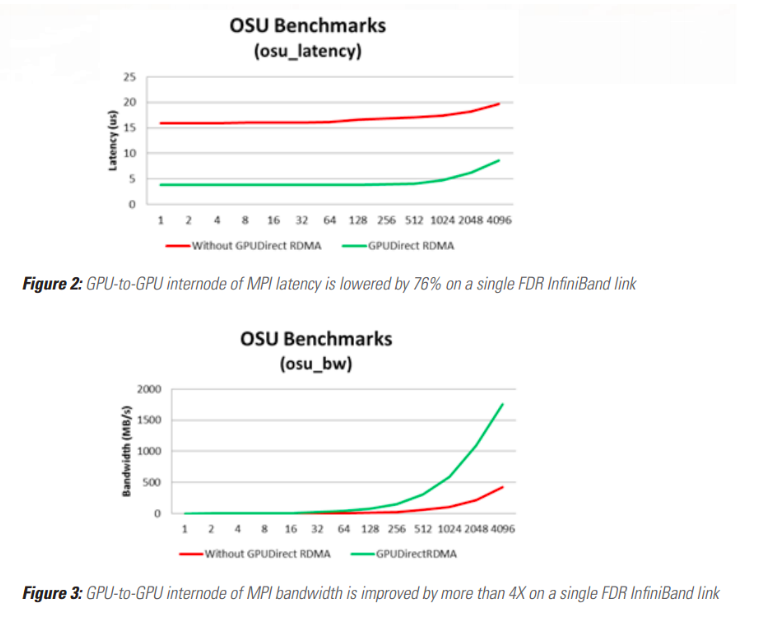   
下图是一个实际的高性能计算应用的性能数据（使用HOOMD做粒子动态仿真），可以看到随着节点增多，使用GPUDirect RDMA技术的集群的性能有明显提升，最多可以提升至2倍：   
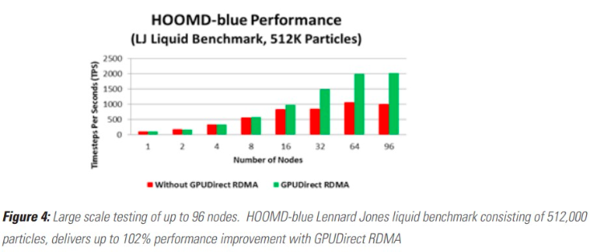   

### Reference  
[1] https://yq.aliyun.com/articles/591403?spm=a2c4e.11153940.blogcont599183.6.5251496fDzFPfZ    
[2] https://yq.aliyun.com/articles/599183?spm=a2c4e.11153940.blogcont591403.16.6d5f1cb8H5JZXA    
[3] https://yq.aliyun.com/articles/603617?spm=a2c4e.11153940.blogcont599183.10.308b496fHArZjo   

  
