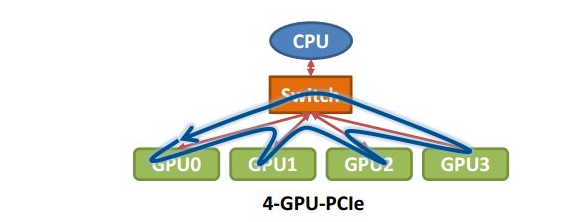
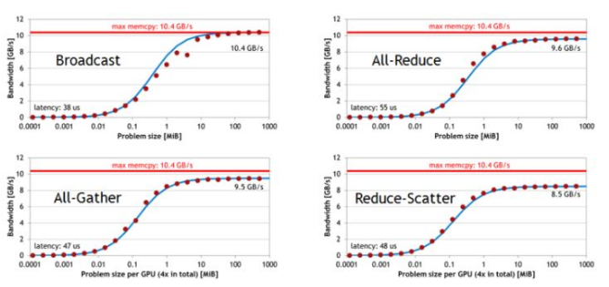
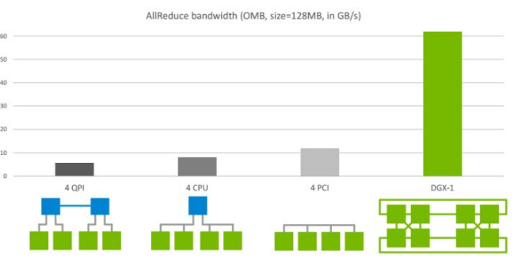

# NCCL  
[官网](https://developer.nvidia.com/nccl)  || [安装手册](https://docs.nvidia.com/deeplearning/sdk/nccl-install-guide/index.html)||[ 
GitHub](https://github.com/NVIDIA/nccl)     
2017-08-03  
## 一、概述  
NCCL是Nvidia Collective multi-GPU Communication Library的简称，它是一个实现多GPU的collective communication通信（all-gather, reduce, broadcast）库，Nvidia做了很多优化，以在PCIe、Nvlink、InfiniBand上实现较高的通信速度。

深度学习框架的开发人员可以依赖NCCL高度优化的MPI兼容和拓扑感知例程，以充分利用多个节点内和跨多个节点的所有可用GPU。领先的深度学习框架，如来自Caffe，Caffe2，Chainer，MxNet，TensorFlow和PyTorch 集成了NCCL加速在多GPU系统的深度学习培训。   
   
下面分别从以下几个方面来介绍NCCL的特点，包括基本的communication primitive、ring-base collectives、NCCL在单机多卡上以及多机多卡实现、最后分享实际使用NCCL的一些经验。   
### 1.communication primitive   
并行任务的通信一般可以分为Point-to-point communication和Collective communication。P2P通信这种模式只有一个sender和一个receiver，实现起来比较简单。第二种Collective communication包含多个sender多个receiver，一般的通信原语包括broadcast，gather,all-gather,scatter,reduce,all-reduce,reduce-scatter,all-to-all等。简单介绍几个常用的操作：   
* Reduce   
从多个sender那里接收数据，最终combine到一个节点上。    
    

* All-reduce  
从多个sender那里接收数据，最终combine到每一个节点上。  
   

而传统Collective communication假设通信节点组成的topology是一颗fat tree，如下图所示，这样通信效率最高。但实际的通信topology可能比较复杂，并不是一个fat tree。因此一般用ring-based Collective communication。   

### 2.ring-base collectives
ring-base collectives将所有的通信节点通过首尾连接形成一个单向环，数据在环上依次传输。以broadcast为例， 假设有4个GPU，GPU0为sender将信息发送给剩下的GPU，按照环的方式依次传输，GPU0-->GPU1-->GPU2-->GPU3，若数据量为N，带宽为B，整个传输时间为（K-1）N/B。时间随着节点数线性增长，不是很高效。   
   
下面把要传输的数据分成S份，每次只传N/S的数据量，传输过程如下所示：   
   
GPU1接收到GPU0的一份数据后，也接着传到环的下个节点，这样以此类推，最后花的时间为S*(N/S/B) + (k-2)*(N/S/B) = N(S+K-2)/(SB) --> N/B，条件是S远大于K，即数据的份数大于节点数，这个很容易满足。所以通信时间不随节点数的增加而增加，只和数据总量以及带宽有关。其它通信操作比如reduce、gather以此类推。那么在以GPU为通信节点的场景下，怎么构建通信环呢？如下图所示：   
单机4卡通过同一个PCIe switch挂载在一棵CPU的场景：   

   
单机8卡通过两个CPU下不同的PCIe switch挂载的场景：   
   

### 3.NCCL实现  
NCCL实现成CUDA C++ kernels，包含3种primitive operations： Copy，Reduce，ReduceAndCopy。目前NCCL 1.0版本只支持单机多卡，卡之间通过PCIe、NVlink、GPU Direct P2P来通信。NCCL 2.0会支持多机多卡，多机间通过Sockets (Ethernet)或者InfiniBand with GPU Direct RDMA通信。    
下图所示，单机内多卡通过PCIe以及CPU socket通信，多机通过InfiniBand通信。
   
同样，在多机多卡内部，也要构成一个通信环   
   
下面是单机 4卡（Maxwel GPU）上各个操作随着通信量增加的带宽速度变化，可以看到带宽上限能达到10GB/s，接近PCIe的带宽。   
   
下图是Allreduce在单机不同架构下的速度比较：   
   
先不看DGX-1架构，这是Nvidia推出的深度学习平台，带宽能达到60GB/s。前面三个是单机多卡典型的三种连接方式，第三种是四张卡都在一个PCIe switch上，所以带宽较高，能达到>10GB/s PCIe的带宽大小，第二种是两个GPU通过switch相连后再经过CPU连接，速度会稍微低一点，第一种是两个GPU通过CPU然后通过QPI和另一个CPU上的两块卡相连，因此速度最慢，但也能达到>5GB/s。   
下图是Allreduce多机下的速度表现，左图两机8卡，机内PCIe，机间InfiniBand能达到>10GB/s的速度，InfiniBand基本上能达到机内的通信速度。   
   
下图是NCCL在CNTK ResNet50上的scalability，32卡基本能达到线性加速比。   
   

### 4.我们的实测经验

首先，在一台K40 GPU的机器上测试了GPU的连接拓扑，如下：   
   
可以看到前四卡和后四卡分别通过不同的CPU组连接，GPU0和GPU1直接通过PCIe switch相连，然后经过CPU与GPU2和GPU3相连。   
下面是测试PCIe的带宽，可以看到GPU0和GU1通信能达到10.59GB/s，GPU0同GPU2~3通信由于要经过CPU，速度稍慢，和GPU4~7的通信需要经过QPI，所以又慢了一点，但也能达到9.15GB/s。
   
   
而通过NVlink连接的GPU通信速度能达到35GB/s：  
   
NCCL在不同的深度学习框架（CNTK/Tensorflow/Torch/Theano/Caffe）中，由于不同的模型大小，计算的batch size大小，会有不同的表现。比如上图中CNTK中Resnet50能达到32卡线性加速比，Facebook之前能一小时训练出ImageNet，而在NMT任务中，可能不会有这么大的加速比。因为影响并行计算效率的因素主要有并行任务数、每个任务的计算量以及通信时间。我们不仅要看绝对的通信量，也要看通信和计算能不能同时进行以及计算/通信比，如果通信占计算的比重越小，那么并行计算的任务会越高效。NMT模型一般较大，多大几十M上百M，不像现在image的模型能做到几M大小，通信所占比重会较高。    
下面是NMT模型单机多卡加速的一个简单对比图：   
   
以上就是对NCCL的一些理解，很多资料也是来自于NCCL的官方文档，欢迎交流讨论。  