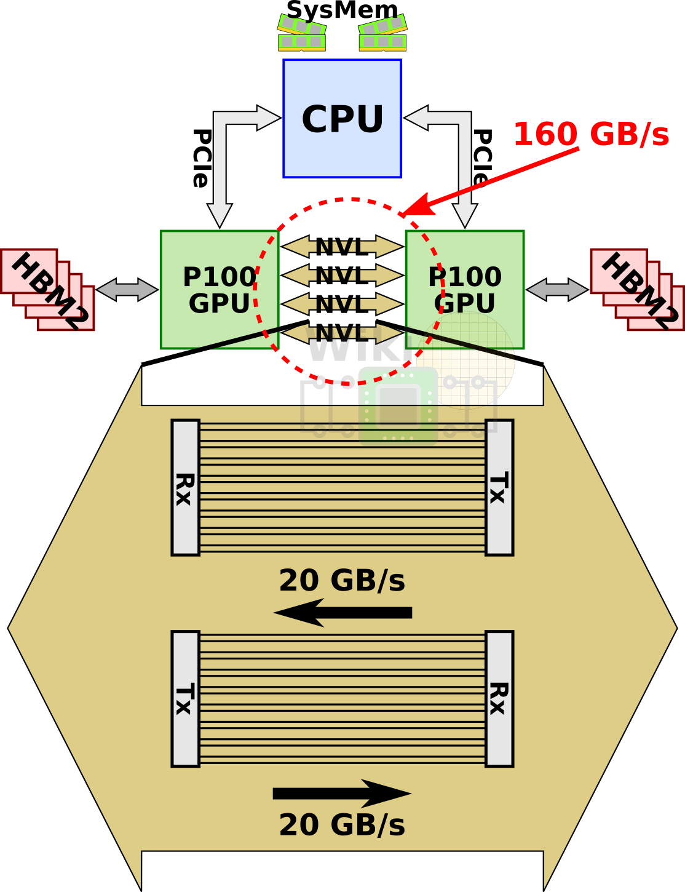
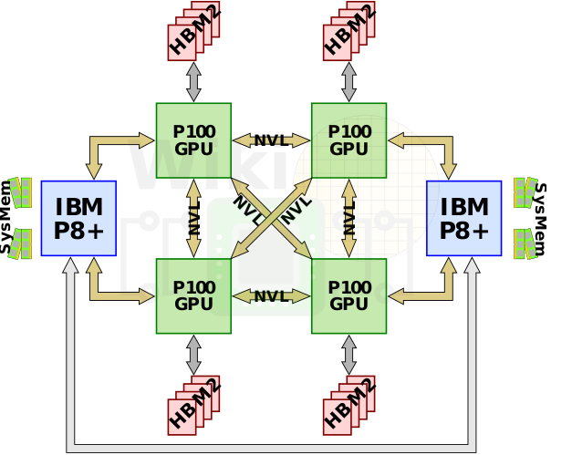
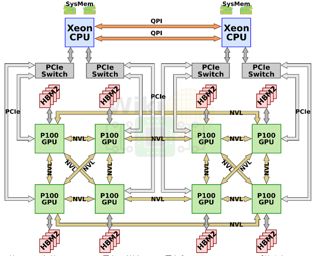
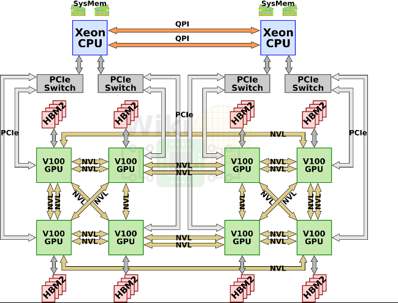

# PCIE & NVlink & InfiniBand   
## 一、PCI总线  
PCI是Peripheral Component Interconnect(外设部件互连标准)的缩写，它是目前个人电脑中使用最为广泛的接口，几乎所有的主板产品上都带有这种插槽。PCI插槽也是主板带有最多数量的插槽类型，在目前流行的台式机主板上，ATX结构的主板一般带有5～6个PCI插槽，而小一点的MATX主板也都带有2～3个PCI插槽，可见其应用的广泛性。   
## 二、[PCIE](https://baike.baidu.com/item/pcie/2167538?fr=aladdin)  
PCI-Express(peripheral component interconnect express)是一种高速串行计算机扩展总线标准，它原来的名称为“3GIO”，是由英特尔在2001年提出的，旨在替代旧的PCI，PCI-X和AGP总线标准。**PCIe属于高速串行点对点双通道高带宽传输**，所连接的设备分配独享通道带宽，不共享总线带宽，主要支持主动电源管理，错误报告，端对端的可靠性传输，热插拔以及服务质量(QOS)等功能。PCIe交由PCI-SIG（PCI特殊兴趣组织）认证发布后才改名为“PCI-Express”，简称“PCI-e”。它的主要优势就是数据传输速率高，目前最高的16X 2.0版本可达到10GB/s，而且还有相当大的发展潜力。PCI Express也有多种规格，从PCI Express x1到PCI Express x32，能满足将来一定时间内出现的低速设备和高速设备的需求。PCI-Express最新的接口是PCIe 3.0接口，其比特率为**8Gbps**，约为上一代产品带宽的两倍，并且包含发射器和接收器均衡、PLL改善以及时钟数据恢复等一系列重要的新功能，用以改善数据传输和数据保护性能。PCIe闪存卡的供应商包括：INTEL、IBM、LSI、OCZ、三星(计划中)、SanDisk、STEC、SuperTalent和东芝(计划中)等，而针对海量的数据增长使得用户对规模更大、可扩展性更强的系统所应用，PCIe 3.0技术的加入最新的LSI MegaRAID控制器及HBA产品的出色性能，就可以实现更大的系统设计灵活性。截止2019年1月份，当前主流主板均支持pcie 3.0。  

  
### 几个概念：
传输速率为每秒传输量GT/s，而不是每秒位数Gbps，因为传输量包括不提供额外吞吐量的开销位； 比如 PCIe 1.x和PCIe 2.x使用8b / 10b编码方案，导致占用了20% （= 2/10）的原始信道带宽。

GT/s —— Giga transation per second （千兆传输/秒），即每一秒内传输的次数。重点在于描述物理层通信协议的速率属性，可以不和链路宽度等关联。

Gbps —— Giga Bits Per Second （千兆位/秒）。GT/s 与Gbps 之间不存在成比例的换算关系。

### PCIe 吞吐量（可用带宽）计算方法：
**吞吐量 = 传输速率 *  编码方案**   

例如：PCI-e2.0 协议支持 5.0 GT/s，即每一条Lane 上支持每秒钟内传输 5G个Bit；但这并不意味着 PCIe 2.0协议的每一条Lane支持 5Gbps 的速率。

为什么这么说呢？因为PCIe 2.0 的物理层协议中使用的是 8b/10b 的编码方案。 即每传输8个Bit，需要发送10个Bit；这多出的2个Bit并不是对上层有意义的信息。

那么， PCIe 2.0协议的每一条Lane支持 5 * 8 / 10 = 4 Gbps = 500 MB/s 的速率。

以一个PCIe 2.0 x8的通道为例，x8的可用带宽为 4 * 8 = 32 Gbps = 4 GB/s。

同理，

PCI-e3.0 协议支持 8.0 GT/s, 即每一条Lane 上支持每秒钟内传输 8G个Bit。

而PCIe 3.0 的物理层协议中使用的是 128b/130b 的编码方案。 即每传输128个Bit，需要发送130个Bit。

那么， PCIe 3.0协议的每一条Lane支持 8 * 128 / 130 = 7.877 Gbps = 984.6 MB/s 的速率。

一个PCIe 3.0 x16的通道，x16 的可用带宽为 7.877 * 16 = 126.031 Gbps = 15.754 GB/s。

由此可计算出上表中的数据
 
## 三、[NVLink](https://baike.baidu.com/item/NVLink/22658185?fr=aladdin)  
NVLink，是英伟达（NVIDIA）开发并推出的一种**总线及其通信协议**。NVLink采用点对点结构、串列传输，**用于中央处理器（CPU）与图形处理器（GPU）之间的连接，也可用于多个图形处理器之间的相互连接**。当前配备并使用NVLink的产品业已发布，多为针对高性能运算应用领域，像是英伟达目前最新的Tesla P100运算卡。     
## 四、NVSwitch  
在2018GTC上，老黄推出了全新的NVSwitch高速互联技术，通过NVSwitch高速互联技术能够让不同的GPU之间进行高速互联。  
根据相关介绍，相比于之前NVSLink能够最多支持8块GPU进行高速互联的成绩，最新推出的NVSwitch技术能够最多支持16块GPU互联。  
在使用NVSwitch进行互联的时候，不仅能够达到高速的效果，同时还能够保证每一个GPU和连接GPU之间都能够保持超低延迟的通讯。  
此外，NVSwitch还能够支持最新的DGX-2技术，相比于之前的DGX-1技术，DGX-2提速能够达到10倍以上，速率大大提升。  

## 五、[InfiniBand](https://baike.baidu.com/item/Infiniband)
InfiniBand（直译为“无限带宽”技术，缩写为IB）是**一个用于高性能计算的计算机网络通信标准**，它具有极高的吞吐量和极低的延迟，用于计算机与计算机之间的数据互连。InfiniBand也用作服务器与存储系统之间的直接或交换互连，以及存储系统之间的互连。  
InfiniBand技术不是用于一般网络连接的，它的主要设计目的是针对服务器端的连接问题的。因此，InfiniBand技术将会被应用于服务器与服务器（比如复制，分布式工作等），服务器和存储设备（比如SAN和直接存储附件）以及服务器和网络之间（比如LAN， WANs和the Internet）的通信。    

## 六、[PCIE—>NVLink—>NVSwitch](https://www.nvidia.com/zh-tw/data-center/nvlink/)  
在2018年gtc会议上，老黄公开了dgx-2，这台售价高达399k美元，重达350磅的怪兽是专门为了加速ai负载而研制的，他被授予了“世界最大的gpu”称号。为什么它被赋予这个名字，它又是如何产生的，我们需要把时间倒退到几年之前。   
### 1.PCIE Switch   
在nvidia推出目前这个方案之前，为了获得更多的强力计算节点，多个GPU通过PCIe Switch直接与CPU相连。  
   
他们之间的pcie 3.0*16有接近32GB/s的双向带宽，但是当训练数据不停增长的时候，这个互联方案本身却成为了致命的系统瓶颈。如果不改进这个互联带宽，那么新时代GPU带来的额外性能就没法发挥出来，从而无法满足现实需求负载的增长。    
### 2.NVLink   
为了解决这个问题，nvidia开发了一个全新的互联构架nvlink。单条nvlink是一种双工双路信道，其通过组合32条配线，从而在每个方向上可以产生8对不同的配对（2bi\*8pair\*2wire=32wire），第一版的实现被称为nvlink 1.0，与P100 GPU一同发布。一块P100上，集成了4条nvlink。每条link具备双路共40GB/s的带宽，整个芯片具备整整160GB/s的带宽。
   
当然，nvlink不仅仅只是限定在GPU之间互联上。IBM将nvlink 1.0添加到他们基于Power8+微架构的Power处理器上，这一举措使得P100可以直接通过nvlink于CPU相连，而无需通过pcie。通过与最近的power8+ cpu相连，4GPU的节点可以配置成一种全连接的mesh结构。  

   
### 3.DGX-1  
第一种nvidia专门为AI加速订制的机器叫做dgx1，它集成了八块p100与两块志强e5 2698v4,但是因为每块GPU只有4路nvlink，这些GPU构成了一种混合的cube-mesh网络拓扑结构，GPU被4块4块分为两组，然后在互相连接。   
  
同时，因为GPU需要的pcie通道数量超过了芯片组所能提供的数量，所以每一对GPU将连接到一组pcie switch上与志强相连，然后两块志强再通过qpi总线连接。   
   
6块P100，每块16GB HBM2显存，总计128GB显存和512GB DDR4-2133系统内存。   
### 4.nvlink 2.0   
nvlink的第二个版本与gv100一同而来。IBM计划在Power9 cpu上给与支持。nvlink 2.0提升了信号的传输率，从20Gb/s到了25Gb/s，双信道总计50GB/s，pre nvlink。同时进一步提升了nvlink数到6路。这些举措让v100的总带宽从p100的160GB/s提升到了300GB/s。
   
顺便说下，除了带宽的增长，nvidia还添加了数个新的operational feature到协议本身。其中最有意思的一个特性是引入了coherency operation缓存一致性操作，它允许CPU在读取数据时缓存GPU显存信号，这将极大的降低访问延迟。   

去年nvidia将原始dgx-1升级到v100架构。因为主要的cube-mesh拓扑结构并没有变化，所以多出来的link用来倍化一些GPU之间的互联。   
  
   
   
### 5.DGX-2   
最近的GTC2018发布的dgx-2，其加倍了v100的数量，最终高达16块v100。同时hbm2升级到32GB/块，一共高达512GB，cpu升级为双路2.7G 24核 志强白金8168.   
   
升级到16块GPU，对于系统而言也要做出巨大的改变，特别是更快更大的互联网络带宽。   
### 6.NVSwitch
那么dgx-2中装载的是什么呢，是一块新的asic - nvswitch。nvswitch是一块独立的nvlink芯片，其提供了高达18路nvlink的接口。这块芯片据说已经开发了两年之久。其支持nvlink 2.0，也就意味着每个接口均能提供双信道高达50GB/s的带宽，那么这块芯片总计能够提供900GB/s的带宽。这块芯片功率100w，基于台积电12nm FinFet FFN nvidia订制工艺，来源于增强的16nm节点，拥有2b个晶体管。     

   
这块die封装在1940个pin大小为4cm2的BGA芯片中，其中576个针脚专门服务于18路的nvlink，剩下的阵脚则用于电源，或者其他I/O接口，比如用于管理端口的x4 pcie，I2c，GPIO等等。   
    

通过nvswitch提供的18路接口，nvswitch能够让nvidia设计出完全无阻塞的全互联16路GPU系统。每块v100中的6路nvlink将分别连接到6块nvswitch上面。这样8块v100与6块nvsiwtch完全连接，构成一个基板。   
   
dgx2拥有两块基板，这两块基板则是通过nvswitch剩余的另一侧接口完全互联在一起，这就构成了一个16路全连接的GPU构架.   
   
两块基板之间的nvswitch之间都有八路link互联，16块GPU每块有6路nvlink的情况下，其总双路带宽达到2400GB/s。有趣的是，其实nvswitch有18路接口nvidia却只用到了其中16路。一种可能性是nv留下两路用于支持ibm的power9处理器（dgx1和2都是用的志强）。在这个复杂的结构中，power9处理器可能分别接在两块基板的nvsiwtch上，这样GPU也与Power9处于全连接状态。如果CPU直接与nvswitch相连，那么pcie就不再担任cpu与gpu相连的责任。目前nvidia还没有向其他厂商开放nvswitch，如果他们决定开放，将会产生一些新型态的，可能更加规模庞大的结算节点。
   
   
在原始的dgx-1中，执行GPU之间的事务处理需要一个额外的hop，这将导致远程访问的不一致性。在很多负载中，这会让利用统一寻址变得困难，产生了一些不确定性。在dgx2中，每一块gpu都可以于另外一块gpu以相同的速度和一致性延迟交流。大型的AI负载能够通过并行化的模型技术得到巨大的提升。回到GTC中，nvidia赋予的名称“世界最大的GPU”。在实践中，因为每块GPU和其他伙伴直接互联，统一寻址也变的简单有效。现在，可以合并512GiB高速带宽的显存，将他虚拟化成一块统一的内存。无论是GPU本身还是nvswitch都有相应的算法用于实现这一统一的内存系统。在程序层面，整台机器将会被当作一块GPU和一个整体的显存，这个显存子系统将会自行管理显存layout，提供最优化的组织架构。      
<iframe height=1080 with=1920 src="../imgs/NVSWITCH.mp4" frameborder=0 allowfullscreen></iframe>
